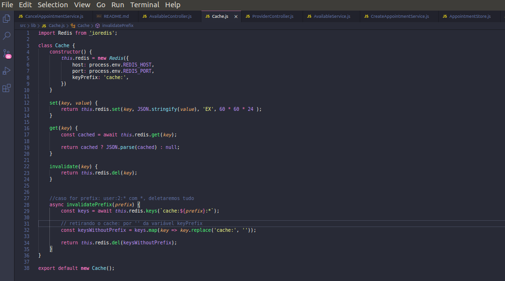

<h1 align="center">
  🥋 Working other patterns for backend nodejs
</h1>
<h2 align="center">

<a href="https://github.com/thurdelima/node-advanced-patterns"></a><br/><br/>





</h2>

<blockquote align="center">
  Class cache for create and destroy caches to optimize operations in backend
</blockquote>

<hr/>

## 💡 About project:

Backend with authentication and some routes cruds with patters service, where we remove business rules of controller and put in folder called service. Pattern validator, where we remove validate rules of controller and put in folder and set in route as midleware.

## 🔥 Functions:

Though aplication we can:

- Authenticate with JWT
- CRUD users
- CRUD appointments

## ⚙️ Some Techs:

- express
- express-async-errors
- date-fns
- bcryptjs
- bee-queue
- cors
- ioredis
- jsonwebtoken
- mongoose
- multer
- nodemailer
- sequelize
- yup


## 🏁 Run project:

Clone repository

```bash
$ git clone https://github.com/thurdelima/node-advanced-patterns
```

enter folder and run command

```bash
yarn
```
run local

```bash
yarn start
```


<br/>

<h4 align="center">
  ---

Made with ♥ by Arthur Lima :wave: [Get in touch!](https://www.linkedin.com/in/arthur-lima-294ab0103/)
</h4>

---
<br/>

<p align="center">

  <a alt="Arthur Lima Linkedin" href="https://www.linkedin.com/in/arthur-lima-294ab0103/">
    </a>
  <a alt="Arthur Lima GitHub" href="https://github.com/thurdelima">
  </a>
 

</p>

